# OFA-Chinese：中文多模态统一预训练模型

## 项目简介

OFA是由阿里达摩院发布的多模态预训练模型，OFA将各种模态任务统一于seq2seq框架中。如下图所示，OFA支持的下游任务包括但不限于Image Caption、Image Classification、
Image genaration、Language Understanding等等。

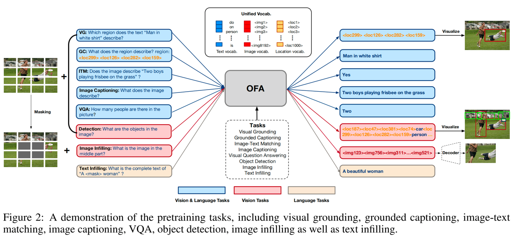

更多关于OFA模型的介绍，可以查阅[OFA论文：Unifying Architectures, Tasks, and Modalities Through a Simple Sequence-to-Sequence Learning Framework](https://arxiv.org/pdf/2202.03052.pdf)
和[OFA官方代码库](https://github.com/OFA-Sys/OFA)

### 项目动机
本项目旨在以huggingface的transformers框架实现中文OFA模型的训练和推理，并且已成功在中文Image Caption任务上完成验证。

在OFA官方代码库中，同时实现了fairseq和transformers两套框架的模型结构，并且官方同时开源了中文和英文的模型权重。基于下列原因，笔者开发了本项目：
- 由于笔者对transformers框架更熟悉，所以希望基于transformers框架，使用域内数据对OFA模型进行finetune，但OFA的中文预训练权重只有fairseq版本，没有transformers版本。
- 中文OFA预训练权重只有fairseq版本，如何将官方fairseq版本的预训练权重转换为transformers权重，从而使得下游任务可以基于transformers框架的中文预训练权重进行finetune。
- 官方代码库中，由于需要兼容各种实验配置，所以代码也比较冗余，使用起来不方便。笔者希望能够将核心逻辑剥离出来，应用于自身任务，实现域内数据进行finetune。

### 主要工作
- 阅读分析OFA官方代码库，剥离出核心逻辑，包括训练逻辑、model、tokenizer等，能够以transformers框架进行下游任务的finetune和推理，简化使用方式。
- 将官方的fairseq版本的中文预训练权重，转化为transformers版本，用于下游任务进行finetune。
- 基于本项目，使用中文多模态MUGE数据集中的Image Caption数据集，以LiT-tuning的方式，finetune模型，验证了本项目的可行性。
- 开源五个transformers版本的中文OFA模型权重，包括笔者由官方权重转化而来的四个权重，以及笔者使用MUGE数据集finetune得到的权重。


### 预模型权重分享
官方开源的中文预训练权重详见：[官方开源的中文预训练权重](https://github.com/OFA-Sys/OFA/blob/main/checkpoints_cn.md) ,预训练权重使用方式详见下文

| 预训练权重                        | 简介                                                                 | 模型地址                                                |
|------------------------------|-----------------------------------------------------------|-----------------------------------------------------|
| YeungNLP/ofa-cn-base-muge-v2 | 笔者加载ofa-cn-base权重，使用muge数据集进行image caption任务finetune得到的权重  | https://huggingface.co/YeungNLP/ofa-cn-base-muge-v2 |
| YeungNLP/ofa-cn-base         | 由官方OFA-CN-Base转换而来的权重              | https://huggingface.co/YeungNLP/ofa-cn-base         |
| YeungNLP/ofa-cn-large        | 由官方OFA-CN-Large转换而来的权重          | https://huggingface.co/YeungNLP/ofa-cn-large        |
| YeungNLP/ofa-cn-base-muge    | 由官方OFA-CN-Base-MUGE转换而来的权重       | https://huggingface.co/YeungNLP/ofa-cn-base-muge    |
| YeungNLP/ofa-cn-large-muge   | 由官方OFA-CN-Large-MUGE转换而来的权重         | https://huggingface.co/YeungNLP/ofa-cn-large-muge   |


## 项目细节

### 项目结构
- data:存放训练数据
- images：存放一些测试的图片
- component:一些模块
  - ofa:ofa模型结构
  - argument.py：定制一些训练配置参数
  - datacollator.py
  - dataset.py
- train_args：训练参数的配置文件
- vocab：笔者转换得到的中文OFA模型的tokenizer的配置目录，本质上是BertTokenizer的配置。
- convert_weight.py：将官方fairseq权重，转换为transformers版本。
- generate.py：加载模型权重，进行image caption的生成脚本。


### 数据集介绍
笔者使用[MUGE数据集](https://tianchi.aliyun.com/dataset/107332) 中的image caption数据，数据集由两个文件组成：caption数据和图片数据，详细可查看官方说明。
将该数据集中的训练集与验证集进行合并，作为本项目的训练集。其中图片共5.5w张，每张图片包含10个caption，最终构成55w个图文对训练数据。

caption数据，jsonl格式：
```
{"image_id": "007c720f1d8c04104096aeece425b2d5", "text": ["性感名媛蕾丝裙，尽显优雅撩人气质", "衣千亿，时尚气质名媛范", "80后穿唯美蕾丝裙，绽放优雅与性感", "修身连衣裙，女人就该如此优雅和美丽", "千亿包臀连衣裙，显出曼妙身姿", "衣千亿包臀连衣裙，穿的像仙女一样美", "衣千亿连衣裙，令人夺目光彩", "奔四女人穿气质连衣裙，高雅名媛范", "V领包臀连衣裙，青春少女感", "衣千亿包臀连衣裙，穿出曼妙身姿提升气质"]}
{"image_id": "00809abd7059eeb94888fa48d9b0a9d8", "text": ["藕粉色的颜色搭配柔软舒适的冰丝面料，满满的时尚感，大领设计也超级好看，露出性感锁骨线条，搭配宽腰带设计，优雅温柔又有气质", "传承欧洲文化精品女鞋，引领风尚潮流设计", "欧洲站风格女鞋，演绎个性时尚装扮", "高品质原创凉鞋，气质与华丽引领春夏", "欧洲风格站艾莎女鞋经典款式重新演绎打造新一轮原创单品优雅鞋型尽显女人的柔美，十分知性大方。随意休闲很显瘦，不仅显高挑还展现纤细修长的腿型，休闲又非常潮流有范。上脚舒适又百搭。", "阳春显高穿搭，气质单鞋不可缺少", "冰丝连衣裙，通勤优雅范", "一身粉色穿搭，梦幻迷人", "艾莎女性，浪漫摩登，演绎角色转换", "超时尚夏季凉鞋，一直“走”在时尚的前沿"]}
```

图片数据，tsv格式(img_id, '\t', img_content)（base64编码）：
```
007c720f1d8c04104096aeece425b2d5 /9j/4AAQSkZJRgABAgAAAQA...
00809abd7059eeb94888fa48d9b0a9d8 /9j/2wCEAAEBAQEBAQEBAQE...
```


### 训练细节
在训练的时候，使用LiT-tuning（Locked-image Text tuning）的策略，也就是将encoder的权重进行冻结，对decoder的权重进行训练。加载ofa-cn-base预训练权重，使用55w的中文图文对，过滤掉一些坏图，
batch size=128，开启混合精度训练，warmup step为3000步，学习率为5e-5，使用cosine衰减策略，训练10个epoch，大约42500个step，最终训练loss降到0.47左右。

由于encoder与decoder共享词向量权重，笔者还分别尝试了冻结与不冻结词向量两种训练方式，两者的训练loss的变化趋势如下图所示。可以看到，训练时不冻结词向量权重，模型的收敛速度提升非常显著，
但相应地也需要更多显存。如果显存不足，在训练时可以冻结词向量，将freeze_word_embed设为true即可。
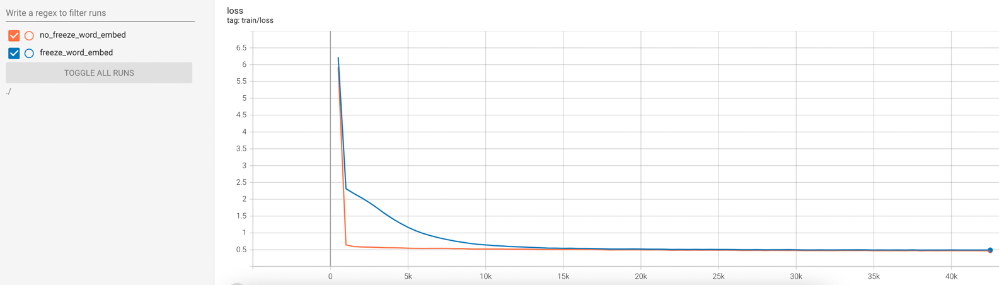


## 使用方法

### 运行环境
python==3.8、transformers==4.20.0、torch==1.12.0

### Quick Start
使用如下脚本，就可成功加载笔者分享的预训练权重，对图片和文本进行预处理，并且得到模型的输出

```python
from component.ofa.modeling_ofa import OFAModelForCaption
from torchvision import transforms
from PIL import Image
from transformers import BertTokenizerFast

model_name_or_path = 'YeungNLP/ofa-cn-base-muge-v2'
image_file = './images/test/lipstick.jpg'
# 加载预训练模型权重
model = OFAModelForCaption.from_pretrained(model_name_or_path)
tokenizer = BertTokenizerFast.from_pretrained(model_name_or_path)

# 定义图片预处理逻辑
mean, std = [0.5, 0.5, 0.5], [0.5, 0.5, 0.5]
resolution = 256
patch_resize_transform = transforms.Compose([
        lambda image: image.convert("RGB"),
        transforms.Resize((resolution, resolution), interpolation=Image.BICUBIC),
        transforms.ToTensor(),
        transforms.Normalize(mean=mean, std=std)
    ])

txt = '图片描述了什么?'
inputs = tokenizer([txt], return_tensors="pt").input_ids
# 加载图片，并且预处理
img = Image.open(image_file)
patch_img = patch_resize_transform(img).unsqueeze(0)

# 生成caption
gen = model.generate(inputs, patch_images=patch_img, num_beams=5, no_repeat_ngram_size=3)
print(tokenizer.batch_decode(gen, skip_special_tokens=True))
```

### 训练脚本
```
CUDA_VISIBLE_DEVICES=0 python train.py --train_args_file train_args/train_ofa.json

后台运行：
CUDA_VISIBLE_DEVICES=0 nohup python train.py --train_args_file train_args/train_ofa.json &
```

### 配置训练参数
在train_args/train_ofa.json中按需配置训练参数，参数说明如下：
- output_dir:训练输出路径
- model_name_or_path：预训练权重名称或路径
- train_caption_file：训练caption路径
- train_image_file：训练图片路径
- test_caption_file：测试caption路径
- test_image_file：测试图片路径
- freeze_encoder：训练时，是否冻结encoder参数
- freeze_word_embed：训练时，是否冻结词向量参数
- num_train_epochs：训练轮次
- max_steps：训练的最大步数，会覆盖num_train_epochs的效果
- per_device_train_batch_size：训练的batch size
- per_device_eval_batch_size：推理的batch size
- learning_rate：学习率
- max_seq_length：文本的最大长度
- logging_steps：多少步打印一次训练日志
- save_steps：多少步保存一次checkpoint
- save_total_limit：最多保存多少个checkpoint
- lr_scheduler_type：学习率的变化策略
- warmup_steps：warmup的步数，会覆盖warmup_ratio的效果
- warmup_ratio：warmup的比例
- gradient_accumulation_steps：梯度累计的步数
- optim：优化器
- seed：随机种子
- fp16：是否使用混合精度进行训练，最好设为True，可以使用更大的batch size，并且加快训练速度
- no_cuda：是否不使用GPU
- dataloader_num_workers：使用多少个线程加载训练数据，根据自己的机器情况，尽量设大一些，否则训练瓶颈会卡在读图片上


## 效果展示
下列测试图片均为从电商网站中随机下载的，并且测试了不同模型权重的生成效果。从生成效果来看，总结如下：
- ofa-cn-base-muge是笔者将由官方fairseq版本的OFA-CN-Base-MUGE权重转换而来的，其生成效果非常不错。证明了fairseq权重转换为transformers权重的逻辑的有效性。
- ofa-cn-base-muge-v2是笔者使用ofa-cn-base进行finetune得到的，其效果远远优于ofa-cn-base，并且与ofa-cn-base-muge的效果旗鼓相当，证明了本项目的训练逻辑的有效性。

| 图片                                          | ofa-cn-base-muge-v2(ours) |  ofa-cn-base   |  ofa-cn-base-muge   |
|---------------------------------------------|:-------------------------:|:---:|:---:|
| 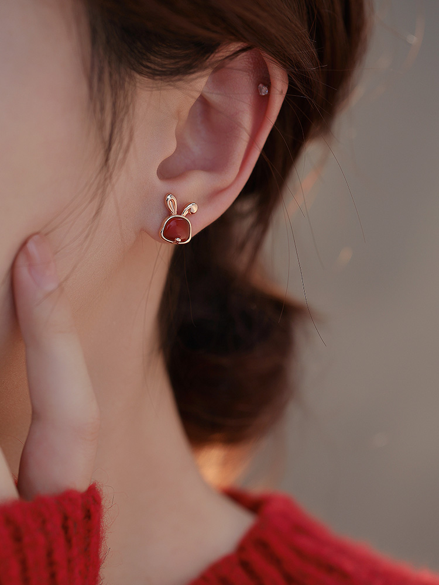 |        精致小耳钉，点缀你的美        |  耳環,夾式耳環espritoutlet台北耳飾,耳環   |  小耳钉，让你的耳朵更有气质   |
| 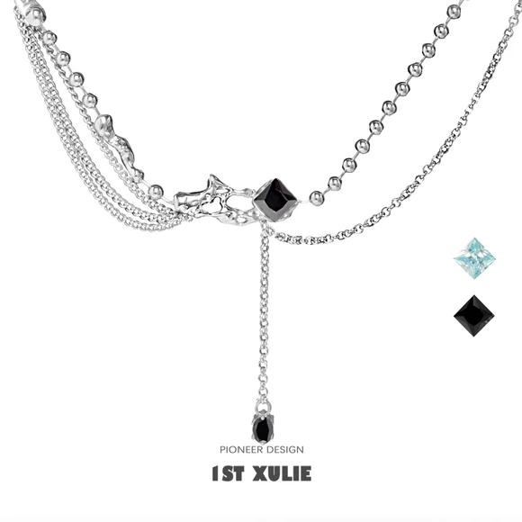 |      精致锁骨链，点缀颈间的小性感       |  项链项链设计矢量矢量图素材第1页   |  精致锁骨链，彰显女性优雅气质   |
| 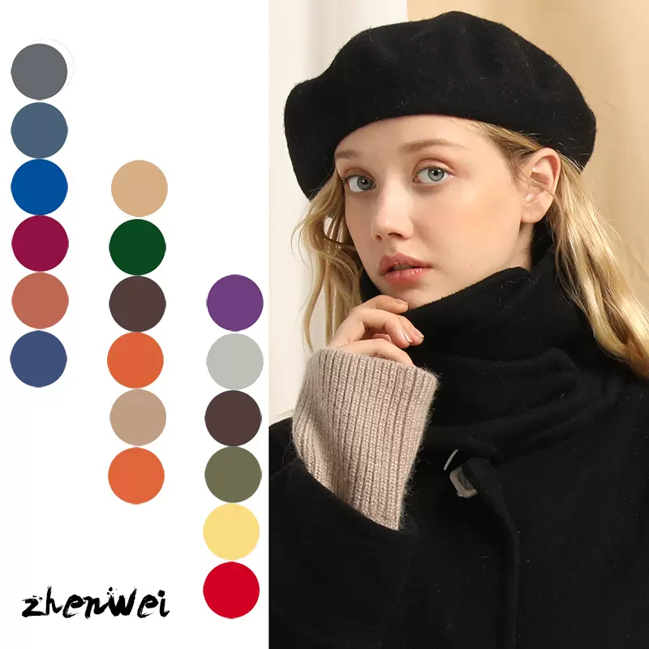 |       复古贝雷帽，演绎秋冬新时尚       |  帽子女秋冬新款韩版时尚百搭羊毛呢贝雷   |  针织开衫，温暖又时髦   |
| 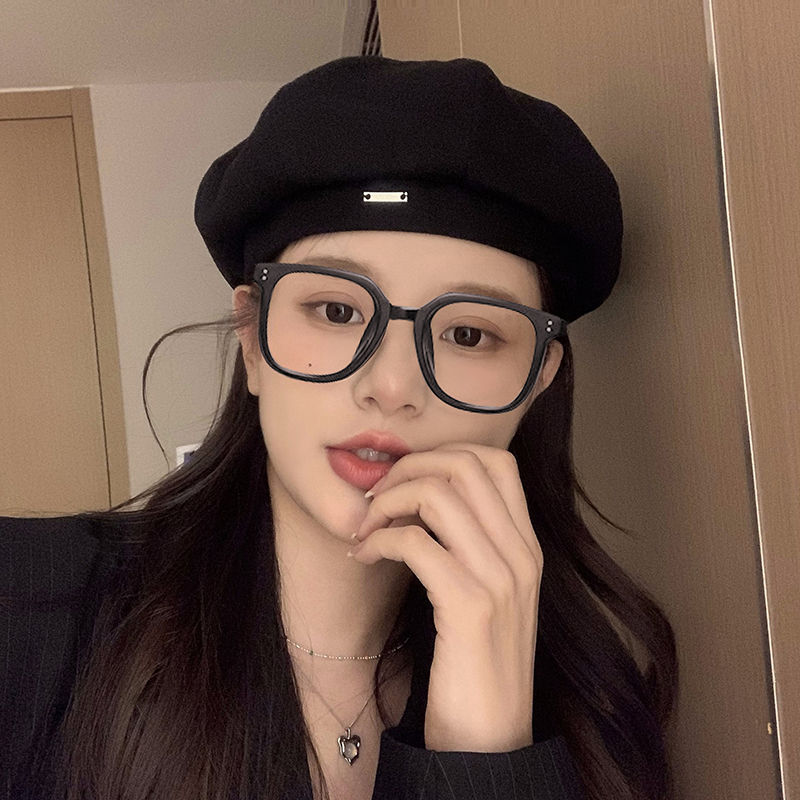 |      复古眼镜框，戴出你的潮流范儿       |  戴眼镜的女生头像_www.qqya.com   |  黑色毛呢外套，时髦又显瘦   |
|  |    小清新手绘美甲，让你的指尖充满艺术感     |  美甲图片大全可爱图片_www.qqya.com   |  美甲指甲油，让你的指甲更美丽   |
|  |      高颜值口红，让你的唇色更加诱人      |  香奈儿chanel香奈兒香水香氛系列香水禮盒香   |  高颜值口红，让你爱不释手   |
| 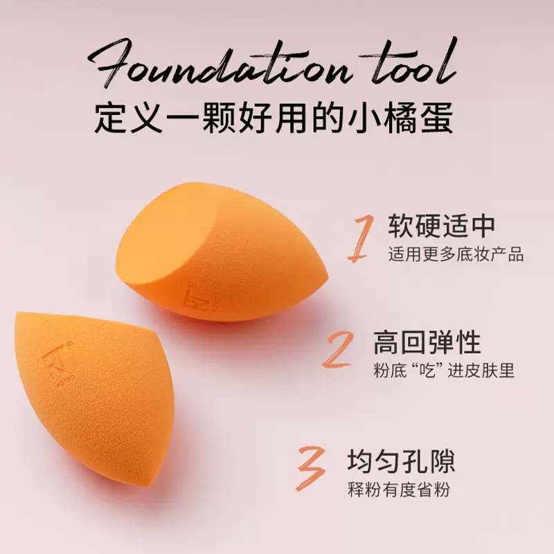 |       高颜值美妆蛋，打造精致妆容       |  日本canmake井田蜜粉饼控油定妆持久遮瑕控油   |  高颜值美妆蛋，轻松打造气质女神   |
| 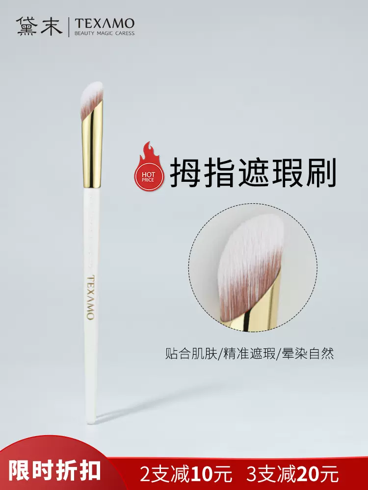 |       化妆刷选的好，妆容没烦恼        |  日本muji无印良品润唇膏保湿滋润唇部护理   |  秋冬季节，你需要一款好看的眼影盘   |
| 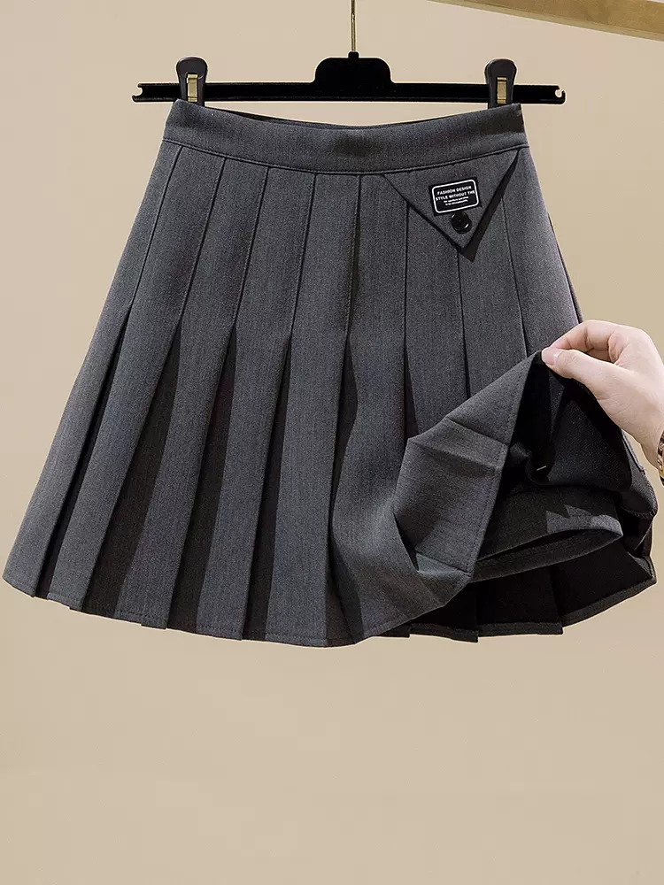 |       时尚百褶裙，让你美出新高度       |  百褶裙半身裙女秋冬2020新款韩版高腰a字   |  尚百搭的半身裙，让你轻松穿出女神范   |
| 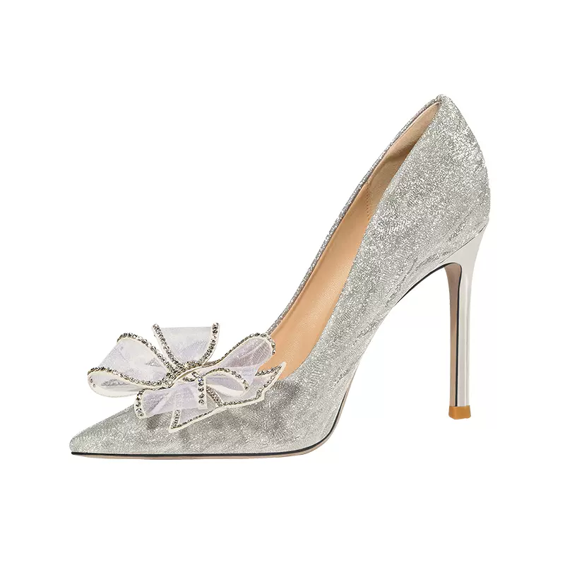 |       尖头高跟鞋，穿出优雅女人味       |  shoesirizachristianlouboutin   |  时尚尖头高跟鞋，穿出优雅女人味   |
| 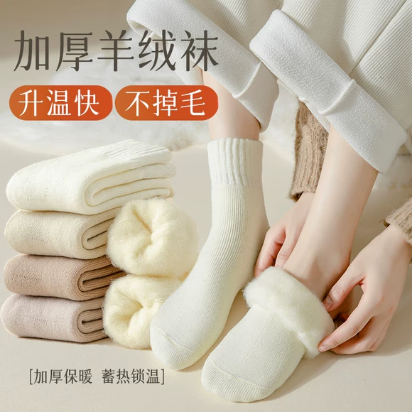 |    加厚纯棉袜子女，冬季中筒袜学生堆堆袜     |  加厚羊绒袜子女中筒袜冬季加绒保暖棉袜   |  加厚羊绒袜，保暖又舒适   |
| 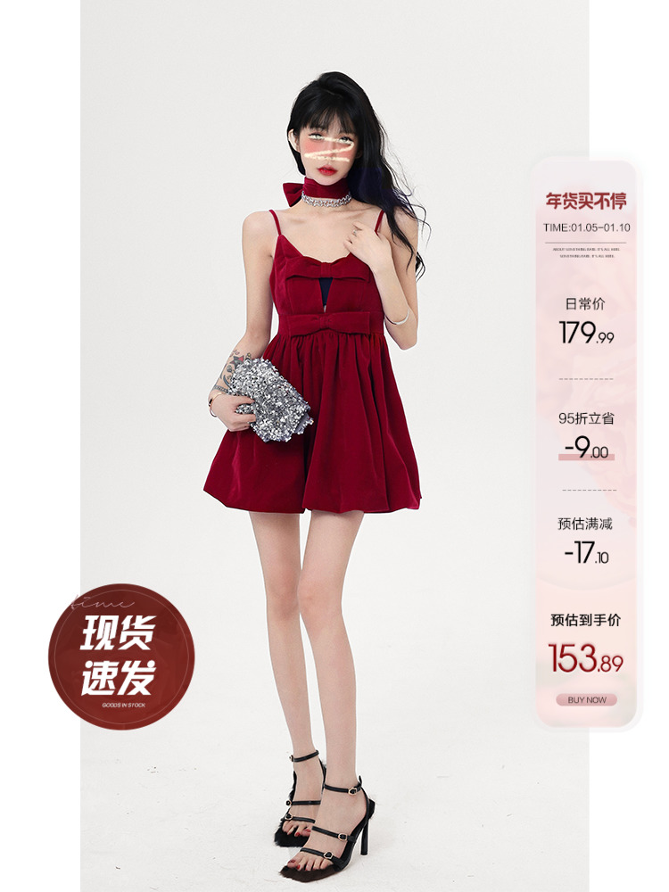 |        吊带连衣裙，清凉一夏         |  日系小清新甜美可爱少女系学院风小红裙   |  一字肩连衣裙，穿出女神范儿   |
| 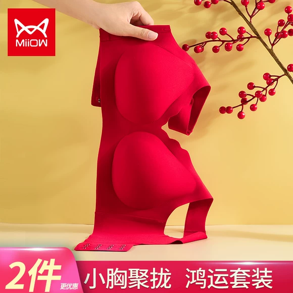 |       内衣套装，给你贴心的呵护        |  红色背景上的女性手拿着一个红色的大象   |  红色婚庆用品，让你的婚礼更有仪式感   |
| 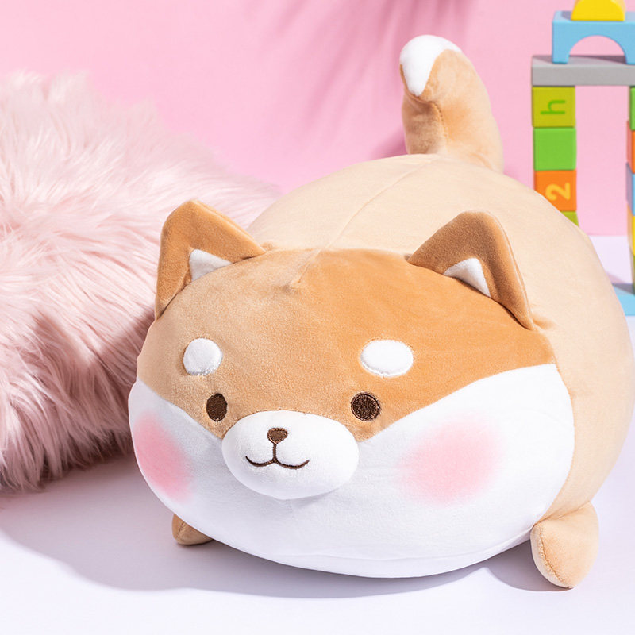 |      儿童毛绒玩具，陪伴宝宝快乐成长      |  【震撼精品百貨】mickymouse_米奇米妮~   |  可爱卡通毛绒玩具，萌化你的少女心   |
| 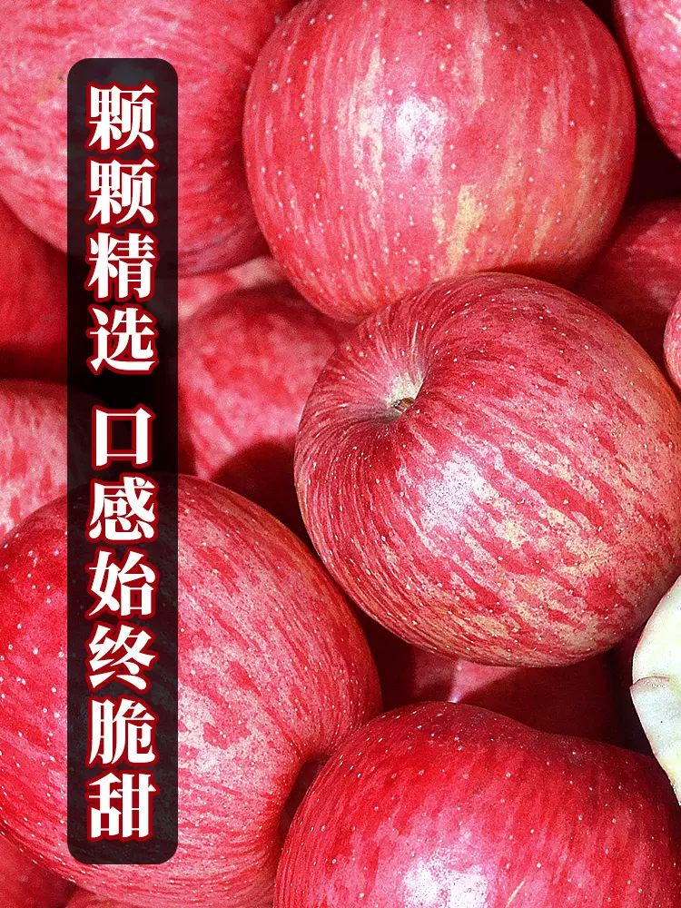 |     烟台红富士苹果，脆甜多汁，香甜可口     |  山东烟台栖霞红富士苹果新鲜水果当季整   |  新鲜水果，让你爱不释手   |
| 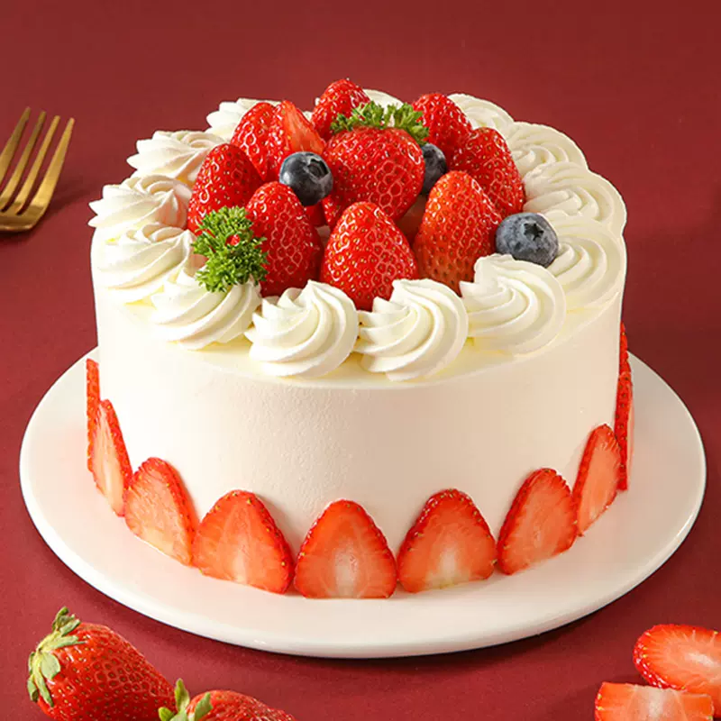 |      草莓奶油蛋糕，满足你的少女心       |  草莓奶油蛋糕图片   |  美味的生日蛋糕，让你爱不释手   |
| 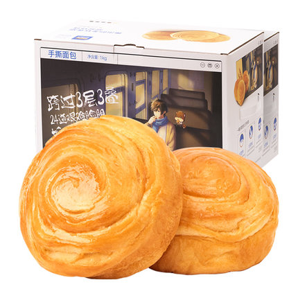 |        手撕面包，营养又美味         |  面包包装盒设计   |  好吃到停不下来的手撕面包，你吃过吗？   |
| 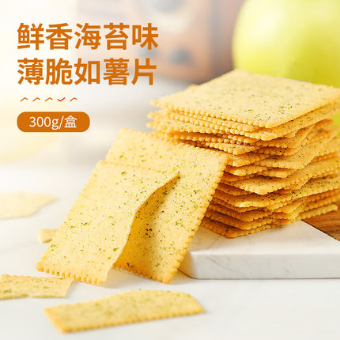 |     香脆薄脆饼干，让你停不下来的美味      |  韩香海苔味薄脆加薯片休闲零食小吃膨化   |  美味零食，让你爱不释手   |
|  |      智能扫地机器人，让家更干净整洁      |  小米米家扫地机器人智能家用全自动吸尘   |  智能扫地机器人，让生活更有仪式感   |
|  |     苹果11promax，性价比超高      |  苹果11手机壳iphone11promax保护套硅胶全包边   |  高颜值手机，你值得拥有   |
| 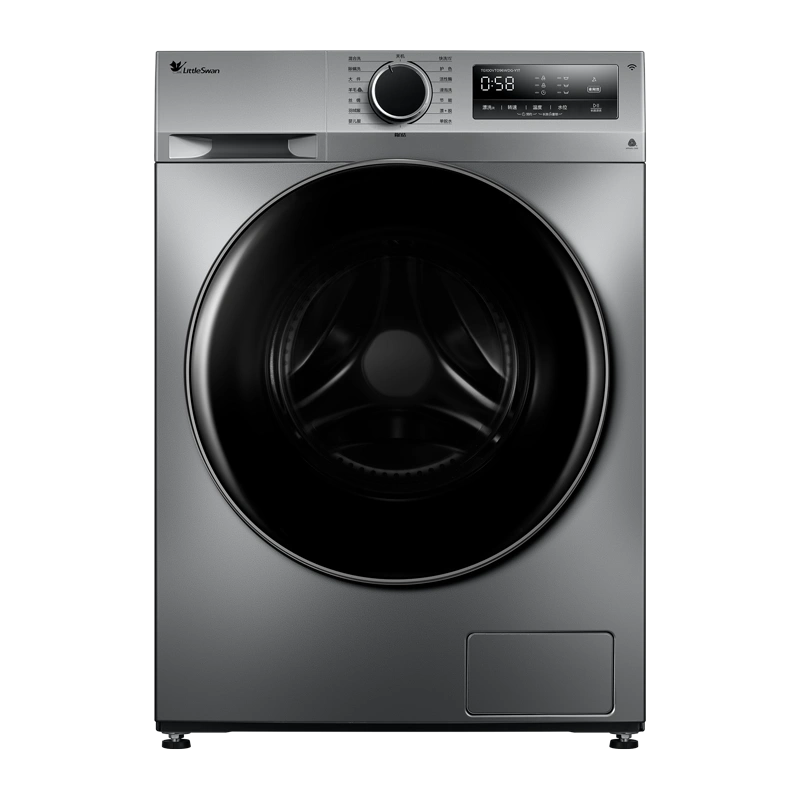 |       智能洗衣机，洗出健康好生活       |  洗衣机图标隔离在白色背景上。3d渲染。   |  智能洗衣机，让你的生活更有仪式感   |
|  |    时尚充电宝，让你的手机充电更快更安全     |  小米移动电源10000毫安超大容量充电宝   |  高颜值充电宝，让你的手机充电更快   |
|  |       时尚运动鞋，让你运动更自信       |  特步专柜款男子夏季跑鞋17新品气垫减震   |  舒适跑步鞋，让你轻松跑出好身材   |
| 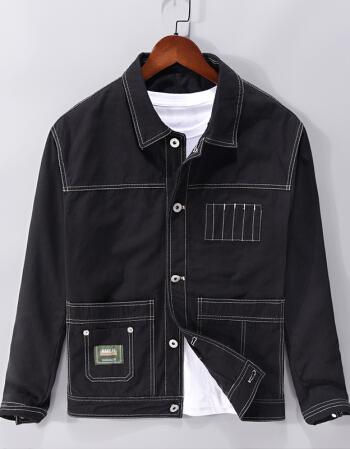 |      时尚潮流资讯，型男把妹约会夹克      |  男童外套春秋季新款韩版儿童夹克中大童   |  时尚潮流，型男原创休闲衬衫   |
| 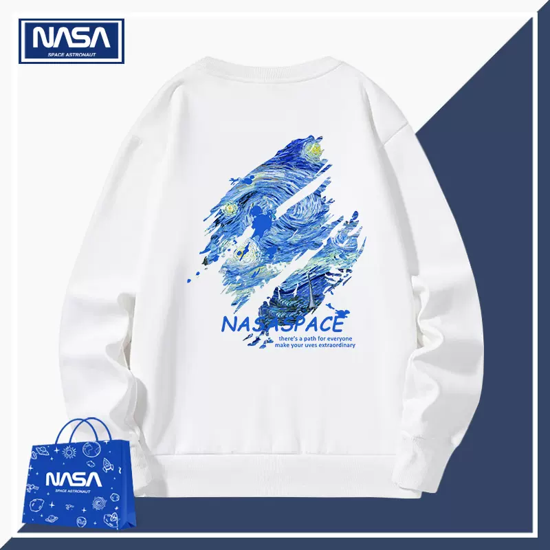 |      时尚灵感指南，型男原创街拍卫衣      |  男士长袖t恤秋季新款韩版潮流宽松圆领   |  时尚灵感指南，型男原创潮流卫衣   |


## 附录

### 权重转换
笔者下载了transformers版本的ofa-base英文权重，以及fairseq版本的中文权重。将两者的权重名称打印出来，进行一一对应，然后将fairseq的权重名称修改成transformers的权重名称。
详细逻辑可见convert_weights.py脚本

### Tokenizer转换细节
经过阅读分析OFA官方代码，笔者得到了以下几个结论：
- transformers版的官方代码中，实现了OFATokenizer，该tokenizer本质是一个bpe，并且仅支持处理英文。
- 对于中文模型，官方使用bert tokenizer，并且在bert的原始词表的基础上添加了若干个特殊token，包括\<s>、\<pad>、\</s>、\<unk>、\<mask>、\<code_0>\~\<code_8191>、\<bin_0>\~\<bin_999>等。

经过处理，笔者最终得到了一份有效的中文词表配置，存放在vocab目录下，直接使用BertTokenizer加载即可。


